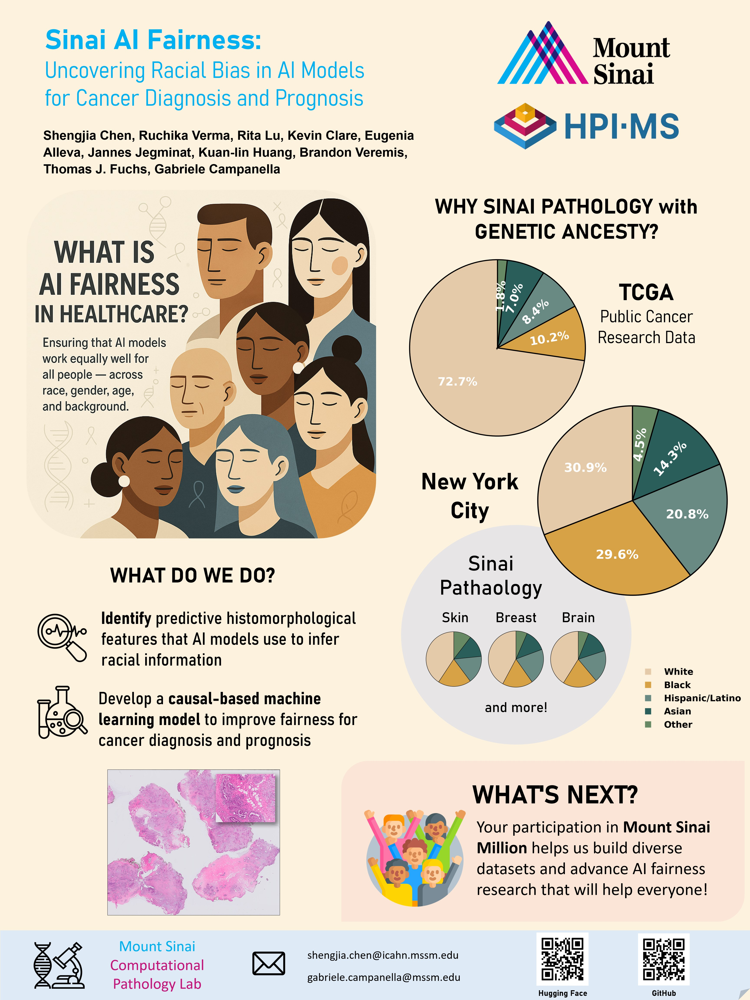
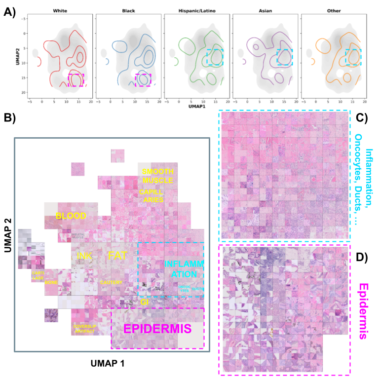
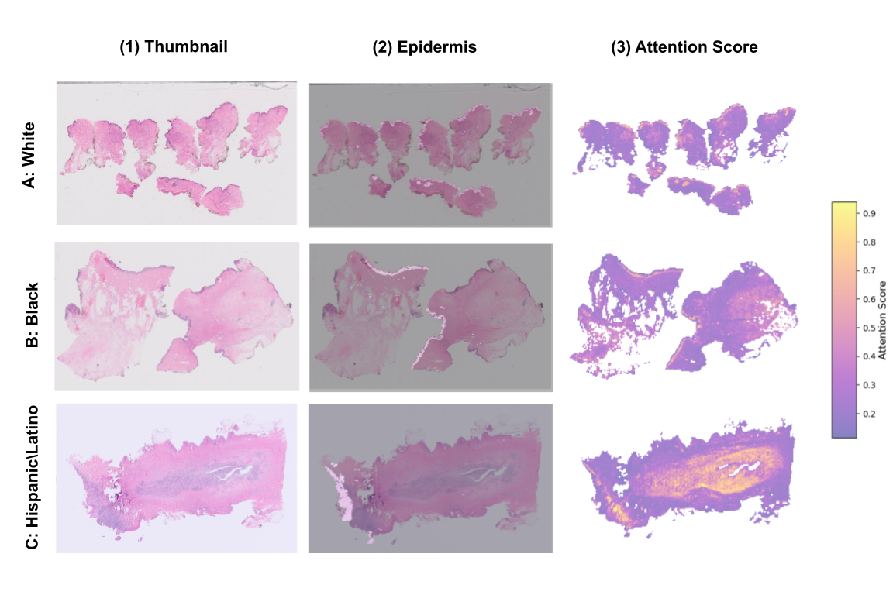

# Project Overview
This repository contains code for investigating fairness and bias in computational pathology (CPath) using artificial intelligence (AI). 



## Predict Patient Self-reported Race from Skin Histological Image
This project explores whether deep learning models can predict self-reported race from digitized dermatopathology slides and identifies potential morphological shortcuts. Our goal is to understand and mitigate unintended demographic biases in AI models for pathology.

This repository accompanies the following publication:

- **Update (July 2025):** Accepted to the MICCAI Workshop on Fairness of AI in Medical Imaging (FAIMI), 2025.
- **Paper Link:**[`Predict Patient Self-reported Race from Skin Histological Image`](https://arxiv.org/abs/2507.21912)

## Abstract

Artificial Intelligence (AI) has demonstrated success in computational pathology (CPath) for disease detection, biomarker classification, and prognosis prediction. However, its potential to learn unintended demographic biases, particularly those related to social determinants of health, remains understudied. This study investigates whether deep learning models can predict self-reported race from digitized dermatopathology slides and identifies potential morphological shortcuts. Using a multisite dataset with a racially diverse population, we apply an attention-based mechanism to uncover race-associated morphological features. After evaluating three dataset curation strategies to control for confounding factors, the final experiment showed that White and Black demographic groups retained high prediction performance (AUC: 0.799, 0.762), while overall performance dropped to 0.663. Attention analysis revealed the epidermis as a key predictive feature, with significant performance declines when these regions were removed. These findings highlight the need for careful data curation and bias mitigation to ensure equitable AI deployment in pathology.

## Data Summary

### Data Availability Statement

The multisite dataset used in this project is currently private due to institutional and patient privacy constraints. We are working towards making the data publicly available in the future.

### Inclusion Criteria

Slides included in this study meet the following criteria:

- Digitized dermatopathology slides within the Mount Sinai Health System (MSHS)
- Available self-reported race in patient level

-To prevent data leakage, slides from the same patient are not assigned to both training and validation folds.

**Summary of the skin dataset by self-reported race compared with Mount Sinai healthcare system, New York City population, and public source (TCGA).**

| Self-reported Race | # Slides (%)      | Patients (%) | Health System Population (%) | NYC Population (%) | TCGA (%) |
|--------------------|------------------|--------------|-----------------------------|--------------------|----------|
| White              | 2,151 (40.8%)    | 39.3         | 43.1                        | 31.2               | 73.7     |
| Black              | 1,015 (19.3%)    | 19.0         | 21.7                        | 29.9               | 10.3     |
| Hispanic/Latino    | 868 (16.5%)      | 16.8         | 18.5                        | 21.0               | 8.5      |
| Asian              | 687 (13.1%)      | 15.7         | 10.3                        | 5.7                | 7.1      |
| Other              | 543 (10.3%)      | 9.3          | 6.4                         | 4.5                | 1.8      |
| **Total Number**   | 5,266            | 2,471        | 114,947                     | 8M                 | 23,276   |

### Patient Ratio and Total Number by Experiment

| Experiment | Patients Ratio (%) | Total Number of Patients | White (%) | Black (%) | Hispanic/Latino (%) | Asian (%) | Other (%) |
|------------|-------------------|-------------------------|-----------|-----------|---------------------|-----------|-----------|
| Exp1       | 100               | 2,471                   | 39.3      | 19.0      | 16.8                | 15.7      | 9.3       |
| Exp2       | 82                | 2,028                   | 37.5      | 19.8      | 17.3                | 15.1      | 10.2      |
| Exp3       | 65                | 1,607                   | 46.9      | 19.9      | 19.6                | 7.2       | 6.5       |

We generated three versions of the experimental dataset to systematically control for confounding factors:

- **Exp1 (Uncurated):** Included all available dermatopathology specimens and yielded the highest overall OvR AUC (0.702), with particularly strong performance in the Asian group (AUC = 0.795). This was attributed to a disproportionately high prevalence of hemorrhoid cases (61%) among Asian patients due to site-specific sampling biases (160 out of 312 Asian patients treated at one site).
- **Exp2 (Balanced Disease):** Mitigated disease-related confounding by rebalancing hemorrhoid cases and removing conditions disproportionately prevalent in certain groups (e.g., gangrene, sun damage-related diagnoses, melanoma, basal cell carcinoma, squamous cell carcinoma, actinic keratosis, seborrheic keratosis), resulting in 2,028 patients (W 37.5%, B 19.8%, H/L 17.3%, A 15.1%, O 10.2%). This adjustment led to a decline in overall OvR AUC (0.671), with the Asian group experiencing the largest drop (AUC: 0.795 → 0.724).
- **Exp3 (Strict ICD Code):** Further restricted the dataset to classical dermatopathology cases (ICD-10 codes L, C, D), fully removing hemorrhoids (ICD-10 K), and reducing the dataset to 1,607 patients (W 46.9%, B 19.9%, H/L 19.6%, A 7.2%, O 6.5%). This further reduced the overall OvR AUC to 0.663, with the Asian group showing the most pronounced decline (0.570), whereas the White group maintained consistently high performance (0.799).

## Methods

### Slide Preprocessing

We standardized and prepared whole-slide images for model training using the script [`/data/make_features.py`](./data/make_features.py). The preprocessing workflow included:

- **Format Standardization:** Converted slides to a consistent image format (TIFF) and standardized magnification to 20x.
- **Tiling and Patch Extraction:** Divided each slide into non-overlapping 224x224 pixel tiles, filtering out tiles with low tissue content.
- **Feature Extraction:** Used a pretrained encoder (e.g., UNI, Virchow, Gigapath, SP22M, ...) to extract feature vectors from each tile for downstream analysis.
- **Metadata Integration:** Linked extracted features to patient-level metadata for stratified experiments.

To run the slide preprocessing on a Linux system, use the following example command:

```bash
python /data/make_features/make_features.py --meta_data_csv <meta_data.csv> --encoder <encoder_name> --tilesize 224 --bsize 512 --workers 8
```

Encoders/FMs options: SP22M, UNI, GigaPath, and Virchow.

- Replace `<meta_data.csv>` with your metadata filename. An example toy metadata file can be found at [`/data/self_reported_race/skin/master_metadata.csv`](./data/self_reported_race/skin/master_metadata.csv).

The script outputs feature embeddings for each slide are saved under `<output_dir>/<encoder>/features/<slide_name>.pth`. Additionally, the corresponding tile coordinates are stored at `<output_dir>/<encoder>/coordinates/<slide_name>.csv`.

Alternatively, you can use feature embeddings generated from other preprocessing pipelines. We also recommend the [Trident pipeline](https://github.com/mahmoodlab/trident) for efficient and scalable whole-slide image preprocessing and feature extraction.

### Model Learning: Attention-Based Multiple Instance Learning (AB-MIL)

To train the model using the provided code, navigate to the `/slide_experiments/code/` directory and run the training script with your desired options. For example:

```bash
python train.py \
    --output ./slide_experiments/skin/SP22M/exp1 \
    --encoder SP22M \
    --organ skin \
    --aggregator GMA_multiple \
    --data_version cohort_08_15_2024 \
```

- 'GMA_multiple' refers to a multi-head attention mechanism inspired by CLAM (see [Lu et al., 2021](https://www.nature.com/articles/s41551-020-00682-w)). This approach outputs distinct attention scores for each race group, enabling the model to learn group-specific representations by assigning separate attention weights to each demographic, which improves interpretability and fairness.

Model Performance Report Across Three Dataset Curations:

| Experiment | Encoder   | White | Black | Hispanic | Asian | Other | Overall AUC | Balanced Accuracy |
|------------|-----------|-------|-------|----------|-------|-------|-------------|-------------------|
| Exp1 (Uncurated) | SP22M     | 0.772 | 0.785 | 0.586    | 0.805 | 0.547 | 0.699       | 0.395             |
|              | UNI       | 0.797 | 0.791 | 0.607    | 0.791 | 0.603 | **0.718**   | **0.400**         |
|              | GigaPath  | 0.801 | 0.753 | 0.598    | 0.801 | 0.522 | 0.695       | 0.388             |
|              | Virchow   | 0.784 | 0.749 | 0.591    | 0.783 | 0.579 | 0.697       | 0.392             |
|              | **Average** | **0.789** | 0.770 | 0.596    | **0.795** | 0.563 | 0.702       | 0.394             |
| Exp2 (Balanced Disease) | SP22M     | 0.744 | 0.751 | 0.569    | 0.701 | 0.577 | 0.668       | 0.368             |
|              | UNI       | 0.760 | 0.773 | 0.560    | 0.715 | 0.569 | **0.676**   | **0.380**         |
|              | GigaPath  | 0.734 | 0.739 | 0.581    | 0.753 | 0.559 | 0.673       | 0.372             |
|              | Virchow   | 0.728 | 0.753 | 0.529    | 0.726 | 0.590 | 0.665       | 0.334             |
|              | **Average** | **0.742** | **0.754** | 0.560    | 0.724 | 0.574 | 0.671       | 0.364             |
| Exp3 (Strict ICD Code) | SP22M     | 0.788 | 0.773 | 0.584    | 0.481 | 0.534 | 0.632       | 0.287             |
|              | UNI       | 0.819 | 0.766 | 0.654    | 0.556 | 0.594 | 0.678       | 0.296             |
|              | GigaPath  | 0.791 | 0.766 | 0.664    | 0.650 | 0.431 | 0.661       | **0.333**         |
|              | Virchow   | 0.796 | 0.742 | 0.656    | 0.592 | 0.613 | **0.680**   | 0.293             |
|              | **Average** | **0.799** | **0.762** | 0.640    | 0.570 | 0.543 | 0.663       | 0.302             |

*Model performance across three dataset curations. AUC is one-vs-all, accuracy is balanced accuracy.*

### UMAP Visualizations

We used a histomorphological phenotype learning (HPL) framework (see [Quiros et al., 2024](https://www.nature.com/articles/s41467-024-48666-7)) to analyze regions of high attention and visualize key tissue structures relevant to self-reported race prediction.

#### Step 1: Prepare metadata and run dimensionality reduction (PCA+UMAP)

First, generate the required metadata and UMAP/PCA features using:

```bash
python /data/Emb_Viz/prepare_meta_source.py \
    --metadata_file /data/self_reported_race/skin/master_metadata.csv \
    --coordinate_path <output_dir>/<encoder>/coordinates/ \
    --embedding_path <output_dir>/<encoder>/features/ \
    --output_path <output_dir>
```

- `<metadata.csv>`: Path to the main metadata file.
- `<coordinate_dir>`: Directory containing tile coordinate CSVs.
- `<embedding_dir>`: Directory containing tile feature .pth files.
- `<output_directory>`: Directory to save processed metadata and features.

#### Step 2: Generate UMAP plots in marimo notebook

To generate the UMAP plots interactively, open the marimo notebook:

```bash
marimo run /data/Emb_Viz/tile_representation_umap.py
```

#### Step 3: KDE Plot Analysis

```bash
marimo run /data/Emb_Viz/attention_map_visualization.py
```

#### Step 4: Mosaic Plot of UMAP visualization
To generate a mosaic plot of the UMAP visualization, run the following command:

```bash
python /EmbViz/plot_scatter_umap.py \
    --data /EmbViz/marimo_metadata.csv \
    --ncol 10 \ 
    --nrow 10 \ 
    --proj1 UMAP_D1 \
    --proj2 UMAP_D2 \
    --ncell 25
```

This will create a grid-based mosaic plot, displaying representative tiles in the UMAP embedding space for visual inspection of tissue morphology across demographic groups.

#### Final Output of UMAP visualization



### Attention Distribution Analysis




## References

1. Lu, M.Y., Williamson, D.F.K., Chen, T.Y. et al. Data-efficient and weakly supervised computational pathology on whole-slide images. Nat Biomed Eng 5, 555–570 (2021). https://doi.org/10.1038/s41551-020-00682-w
2. Claudio Quiros, A., Coudray, N., Yeaton, A. et al. Mapping the landscape of histomorphological cancer phenotypes using self-supervised learning on unannotated pathology slides. Nat Commun 15, 4596 (2024). https://doi.org/10.1038/s41467-024-48666-7
